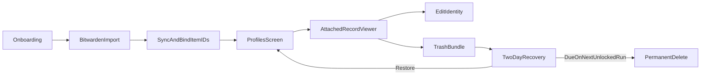

# Bitwarden-Synced Employee Profiles

## Product shape

Expand the compact desktop window into a responsive master-detail workspace (approximately 960×720) and reproduce the supplied visual direction:

- White rounded workspace shell on a light zinc desktop, thin gray borders, restrained shadow, and almost exclusively black/zinc controls.
- Persistent top bar with compact DOWNLOWd mark, live status, centered segmented navigation, and one black contextual action button.
- Inter/SF-style typography with bold uppercase section labels, generous spacing, compact metadata, rounded cards, black active pills, and muted pending states.
- Use these screenshots as visual acceptance references:
  - [Onboarding reference](/Users/cameroncohen/.cursor/projects/Users-cameroncohen-Developer-projects-DOWNLOWd/assets/Figma_2026-07-19_13.40.07-a62d8acc-be97-4bcb-913b-0e8e62cb51df.png)
  - [Ledger reference](/Users/cameroncohen/.cursor/projects/Users-cameroncohen-Developer-projects-DOWNLOWd/assets/Figma_2026-07-19_13.40.15-3613132a-e4fe-4257-be01-352edeac878f.png)
  - [Settings reference](/Users/cameroncohen/.cursor/projects/Users-cameroncohen-Developer-projects-DOWNLOWd/assets/Figma_2026-07-19_13.40.22-093517ab-9148-4f8f-8e03-7485922d7854.png)
- **Onboarding:** Match the two-column employee-card composition: initials avatar, completion ring, name, real profile metadata, record count, and status pill. Keep file intake, passphrase, run/resume controls, and account checkpoints in a compact action drawer or footer rather than cluttering the card grid. After import, bind every generated vault item to an immutable employee ID.
- **Profiles:** New dedicated screen with employee list/search on the left and an attached record viewer on the right.
  - Profile header: employee name, sync state, last sync, account-completion summary, Resume Accounts.
  - Record rail: **Identity**, **Email Login**, **Hyatt**, **Marriott**, **Work Card**. Missing records remain visible as “Not created.”
  - Viewer: grouped identity fields; login username/URI with password masked by default and explicit reveal; card number/CVV masked with explicit reveal. Sensitive values remain memory-only and are cleared when the profile closes, session expires, or sync refreshes.
  - Identity edit mode: Edit → validated fields → Save/Cancel. Login and card records are view-only in this pass.
  - Delete panel: previews the exact Bitwarden item IDs in the employee bundle, requires destructive confirmation, shows the two-day recovery deadline, and offers Restore while pending.
- **Ledger:** Recreate the weekly bars, summary tiles, black table header, transaction rows, and Export action using actual transaction data.
- **Settings:** Recreate the Storage, Automation, and Danger Zone sections, including black section headers, compact toggles, contextual Save action, profile-sync controls, and two-day deletion-policy copy. “Clear vault” must use the scoped bundle deletion workflow rather than a broad name-based delete.

## Vault identity and local metadata

- Introduce a versioned `EmployeeRecord` keyed by immutable UUID, not full name. Store only display metadata, account state, deletion timestamps, and durable vault references locally.
- Each `vault_ref` records role (`identity`, `email_login`, `hyatt_login`, `marriott_login`, `work_card`), Bitwarden item ID/type, organization/collection IDs, and last observed `revisionDate`.
- Add hidden correlation fields (`DOWNLOWD Employee ID`, `DOWNLOWD Record Role`) to newly generated Bitwarden items in [bw_import_converter.py](/Users/cameroncohen/Developer/projects/DOWNLOWd/bw_import_converter.py). After import, run `bw sync`, locate these tags, and persist the actual vault IDs.
- Add a one-time legacy reconciliation for existing `— Work Identity/Login/Card` records. Require a unique exact match; surface ambiguous records instead of guessing.
- Migrate current profile/account metadata out of name-keyed retention entries into a new [employee_profiles.py](/Users/cameroncohen/Developer/projects/DOWNLOWd/employee_profiles.py). Keep full identity, passwords, card numbers, SSNs, and DOB exclusively in Bitwarden.
- Add stable `employee_id` linkage to [transaction_db.py](/Users/cameroncohen/Developer/projects/DOWNLOWd/transaction_db.py), retaining employee name only as a display snapshot.

## Direct Bitwarden synchronization

Extend [integrations.py](/Users/cameroncohen/Developer/projects/DOWNLOWd/integrations.py) with session-aware operations:

- `sync()`, `get_item(id)`, `create_item(payload)`, `edit_item(id, payload)`, `trash_item(id)`, `restore_item(id)`, and `delete_item_permanently(id)`.
- Encode JSON through `bw encode` before create/edit; parse returned item JSON and retain its ID/revision.
- Fetch record details only when selected in Profiles. Never log returned payloads or write them to disk.
- Before identity save: sync, reload the item, compare `revisionDate`, and show a conflict/reload prompt if Bitwarden changed since the viewer loaded.
- On confirmed Hyatt/Marriott creation, create a real Bitwarden Login item and bind its returned ID; account status is then derived from the vault reference rather than an unaudited local flag.

## Identity editing and two-day deletion

- Identity edits patch only supported native identity/custom fields; preserve unknown fields and collection/organization metadata from the fresh Bitwarden object.
- “Delete employee” immediately moves Identity, Email Login, Hyatt, Marriott, and Work Card items to Bitwarden Trash. Bitwarden normally retains trash for 30 days, so DOWNLOWd records `purge_after = trashed_at + 2 days` and performs explicit permanent deletion after that deadline.
- The existing scheduler in [data_retention.py](/Users/cameroncohen/Developer/projects/DOWNLOWd/data_retention.py) checks pending profile deletions at startup and periodically. Permanent purge occurs on the first run after the deadline with an unlocked vault.
- Partial trash/purge failures remain visible and retryable; never mark the local profile deleted until every referenced item succeeds. Restore invokes `bw restore item` for every successfully trashed item before the deadline.
- Audit only employee UUIDs, redacted item IDs, action, result, and deadline—never vault field values.

## UI implementation

Refactor [gui.py](/Users/cameroncohen/Developer/projects/DOWNLOWd/gui.py):

- Create reusable shell primitives for top navigation, segmented tabs, contextual action button, section rules, cards, pills, toggles, summary tiles, and table headers so all screens match the references.
- Add `profiles` to the centered top navigation and contextual actions (`Sync`, `Edit`, `Resume`, `Delete`).
- Extract reusable employee cards from Onboarding; move the full profile grid/detail experience to Profiles. Onboarding shows only queued files and current-run progress.
- Build Profiles as a visual extension of the reference: compact employee rail/cards on the left; white detail card on the right; black active record pill; five-record status rail; grouped field rows; and a fixed action footer for Edit, Resume, Restore, or Delete.
- Render actual progress: completion rings/counts come from bound Bitwarden records and account state, never placeholder roles, document totals, balances, or employees.
- Preserve keyboard navigation, visible focus, minimum readable font sizes, and a usable reduced-width layout even though the screenshots are the desktop target.
- Run every Bitwarden operation on a worker thread; marshal state updates and dialogs through `root.after()`.
- Add explicit loading, locked-vault, sync-conflict, missing-record, partial-delete, pending-purge, and restored states.

## Verification

Expand [tests/test_security_behaviors.py](/Users/cameroncohen/Developer/projects/DOWNLOWd/tests/test_security_behaviors.py) with mocked CLI coverage for sync/get/create/edit/trash/restore/permanent-delete, encoded payload handling, revision conflicts, item-ID reconciliation, legacy ambiguity, and partial failures. Add profile-store migration, stable transaction linkage, secret masking/clearing, Hyatt/Marriott item creation, two-day purge timing, restore, and “do not purge until every item succeeds” tests. Finish with the existing full test suite, compile check, dependency check, visual comparison of all four screens against the supplied references, keyboard/focus smoke testing, and a manual sync/edit/trash/restore smoke test against a disposable Bitwarden vault.