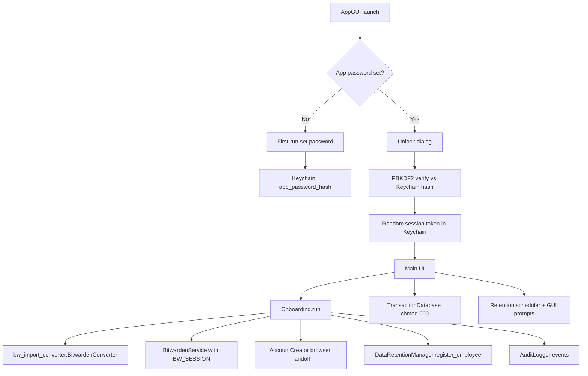

# Fix all code-review findings

**Chosen defaults:** real app password in Keychain (1A); plaintext SQLite + `0o600` + remove encryption claims (2B). No SQLCipher in this pass.

## Architecture after fix

## Phase 1 — Unblock the product (#1, #5, #10)

### 1a. Restore `Onboarding` orchestrator in [`onboarding.py`](onboarding.py)

BASE had a working `Onboarding` class that scanned `HQ-*` files, converted, imported to Bitwarden, optionally provisioned partners, and secure-deleted. Current file only has a duplicated `BitwardenConverter`.

- Move converter ownership to [`bw_import_converter.py`](bw_import_converter.py) only; [`onboarding.py`](onboarding.py) imports `convert_file_to_bitwarden_json` from it (delete the duplicate class from `onboarding.py`).
- Reintroduce `BitwardenConfig`, `OnboardingConfig`, and `Onboarding` matching what [`gui.py`](gui.py) already calls: `Onboarding(bw_service)` and `run(downloads, password, config)`.
- Pipeline body (adapted from BASE `747b8d1`):
  - Find `HQ-*.{txt,rtf}` under downloads
  - Convert via `bw_import_converter`
  - Import via `BitwardenService.import_json` (session-aware — see 1b)
  - Optional partner accounts via [`account_automation.py`](account_automation.py) when config toggles exist (add `provision_outlook/hyatt/marriott` bools to `OnboardingConfig` + GUI checkboxes, default off or on to match current UI)
  - Secure-delete local files when `secure_delete_local`
  - Register each employee with `DataRetentionManager`
  - Emit audit events via `AuditLogger`
- In [`gui.py`](gui.py): remove the silent stub/`AttributeError` swallow (lines 28–41). Import `Onboarding` / configs directly and fail loud on ImportError.

### 1b. Fix Bitwarden session propagation (#5) in [`integrations.py`](integrations.py)

- Keep `session_key` from `bw unlock --raw` / `bw login --raw` on `BitwardenService` (instance field).
- Pass `--session <key>` (or set `BW_SESSION` in subprocess env) on `get_collection_id`, `import_json`, `list_items`, `delete_item`, `get_status`.
- Remove the nonsensical `bw unlock --session` follow-up call.
- Clear session on failed unlock / logout path if present.

### 1c. Deduplicate converter (#10)

- Single source: [`bw_import_converter.py`](bw_import_converter.py).
- Remove unused `pysqlcipher3-binary` from [`pyproject.toml`](pyproject.toml).

## Phase 2 — Real app auth (1A / #2)

In [`integrations.py`](integrations.py) `SessionManager` + [`gui.py`](gui.py) auth dialog:

- Keychain keys: `app_password_hash`, `app_password_salt`, `app_session_token` (random `secrets.token_urlsafe(32)`).
- First launch (no hash): dialog to **set** password (confirm field); store PBKDF2-HMAC-SHA256 (e.g. 200k iterations) hash+salt in Keychain.
- Later launches: verify password against hash; reject mismatch; only then mint session.
- Keep 1-hour timeout via session created-at stored alongside token (JSON blob or separate Keychain key).
- Call `AuditLogger.log_authentication(success/failure)` from the dialog.
- Update [`SECURITY_FEATURES.md`](SECURITY_FEATURES.md) / [`README.md`](README.md): remove “any non-empty password” MVP note; document real hashing.

## Phase 3 — Honest local data protection (2B / #3, #4, #6)

### Transaction DB (#3)
In [`transaction_db.py`](transaction_db.py):
- Keep `sqlite3` (no SQLCipher).
- After create/open: `os.chmod(db_path, 0o600)`.
- Remove dead `DB_KEY` / commented PRAGMA / unused `hashlib`.
- Docs: state “local SQLite with owner-only permissions; not encrypted at rest.”

### Credential migration (#4)
In `CredentialStore._migrate_to_keychain`:
- After successful Keychain write, securely overwrite+unlink the source file (reuse `_secure_delete_file` pattern).
- Do **not** leave `.json.backup`. If migrate fails mid-way, leave original intact and log error.

### `.gitignore` (#6)
Restore/add:
- `.onboarding_credentials.json`
- `.onboarding_credentials.json.backup`
- `logs/`
- Keep `*.egg-info/` (already added); stop committing egg-info churn if currently dirty.

## Phase 4 — Wire security modules for real (#7, #8, #9)

### Audit (#7)
- Import `get_audit_logger()` in gui/onboarding paths.
- Log: auth, import start/complete, transaction add/delete, retention actions, config changes (collection name).

### Retention (#8)
In [`data_retention.py`](data_retention.py) + gui:
- Change milestone checks from `if/elif` to independent `if`s so overdue day-15/20 are not blocked forever.
- Scheduler: for `auto_shred` / `shred_logs`, call `execute_auto_shred` / `execute_log_shredding`; for day 5/10, surface modal prompts via `root.after` (queue actions to main thread).
- `execute_log_shredding`: actually secure-delete matching files under `logs/` (and audit log entries for that employee if feasible); fail closed if delete fails.
- Start scheduler once from `AppGUI` after successful auth (`start_scheduler`).
- `register_employee` from onboarding after each successful convert.

### Account automation (#7)
- Call `AccountCreator` from `Onboarding.run` when toggles enabled (browser handoff is fine for MVP).
- Remove or rename `validate_network_isolation()` success stub — either delete it or make it return `False` / raise `NotImplementedError` so nothing trusts it. Prefer delete unused `NetworkIsolatedExecutor` if nothing calls it.

### Transaction delete (#9)
In [`gui.py`](gui.py) `_delete_selected_transaction`:
- Store DB `id` in tree item `iid` or values when populating.
- Call `transaction_db.delete_transaction(id)`; refresh; audit log.

## Phase 5 — Docs + smoke verification

- Align [`README.md`](README.md) and [`SECURITY_FEATURES.md`](SECURITY_FEATURES.md) with reality: real app password; no SQLCipher; retention actually runs; audit wired.
- Manual smoke checklist (no test suite yet — add a minimal `tests/` only if time allows for auth hash verify + retention milestone independence + BW session env helper):
  1. Fresh Keychain: set password → unlock with wrong pw fails → correct succeeds
  2. Drop `HQ-*.txt` → Run Import → Bitwarden import with session works
  3. Add/delete transaction persists/deletes in DB; file mode `600`
  4. Migration of old credentials file leaves no plaintext leftover
  5. Retention day-15 path deletes employee transactions when forced in debug/time-skew helper

## Out of scope (explicit)

- Full SQLCipher encryption (tracked as future work in docs only)
- M365 Graph email provisioning (removed earlier; not restoring)
- New automated CI suite beyond a few unit tests if added opportunistically
